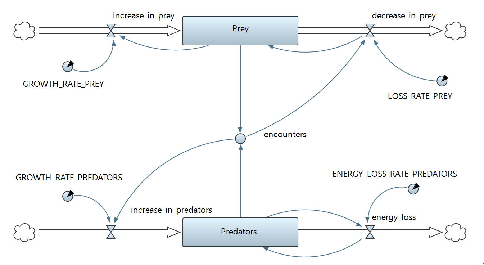

# SysDynPy

**Status**: SysDynPy was developed as a college assignment and is currently not under active development. It is provided "as is" for now, but can be used as a code basis for further development if needed.

## Table of Contents
- [Overview](#overview)
- [Installation](#installation)
- [How to get started](#how-to-get-started)
- [Module documentation](#module-documentation)

## Overview
SysDynPy - short for *System Dynamics Python* - is a collection of Python modules
to assist you with implementing and running System Dynamics models. It aims at providing a simple to use framework to do quick simulations.

It provides classes representing core System Dynamics objects, like Stocks and Flows, which can be instantiated, connected and configured to build a model. The prerequisite to using this library effectively is, that you already have a model in mind that you want to implement, maybe in form of a simulation diagram. Once the model is built it you can run a simulation and store the results to your filesystem for further use. In addition to that a basic way of visualization in form of line plots is provided to get a first impression of the results.

## Installation

The easiest way is to install the package from PyPi: TODO upload

    pip install --upgrade pip
    pip install SysDynPy

The alternative is building from source. There are multiple tools to use for this. [This tutorial](https://packaging.python.org/tutorials/packaging-projects/#generating-distribution-archives) shows one possible way. You simply install the build module 

    python -m pip install --upgrade build

and run

    python -m build

from the repositories root folder. This creates the `dist` directory, which contains the file `SysDynPy-0.1.0-py3-none-any.whl`. This file can be installed from the local filesystem with pip (make sure to navigate into the `dist` folder first):

    pip install SysDynPy-0.1.0-py3-none-any.whl


## How to get started
The [examples directory](examples) provides some simple models that can serve as a starting point. We will break down the code of the Lotka-Volterra model (which is a quite common example in the System Dynamics field) step by step.
The simulation diagram for the model we are about to implement looks like this:
. 

#### 1. Creating the system
This step is pretty simple. We create a system so we can reference it when creating the system elements in the next step. The system keeps track of all system elements and can show them if needed by using `lv_system.show_system_elements()`.

```python
number_of_simulation_steps = 200

# create system
lv_system = System("lotka-volterra")
```

#### 2. Creating system elements
This is where the system gets filled with elements. We define stocks, parameters, flows and a dynamic variable. This is what the constructor arguments mean:

* **name**: A name for the element. This is used for error messages and the exporter.
* **value**: The initial value for the element
* system: The reference to the system object
* **var_name**: The name of the variable the object is assigned to once it is created. This is needed to have access to the variable name in other modules (e.g. to execute the lambda expression there).
* **calc_rule**: A lambda expression that defines how the value should be calculated.

Note that parameters have a fixed value, so the don't need a calculation rule. Flows and dynamic variables have no initial value.

```python
# create elements
predators = Stock(name="Predators", value=40, system=lv_system, var_name="predators",
    calc_rule=lambda: increase_in_predators - energy_loss)
prey = Stock(name="Prey", value=500, system=lv_system, var_name="prey", 
    calc_rule=lambda: increase_in_prey - decrease_in_prey)

GROWTH_RATE_PREY = Parameter(name="GROWTH RATE PREY", value=0.05,
system=lv_system, var_name="GROWTH_RATE_PREY")
LOSS_RATE_PREY = Parameter(name="LOSS RATE PREY", value=0.001,
    system=lv_system, var_name="LOSS_RATE_PREY")
GROWTH_RATE_PREDATORS = Parameter(name="GROWTH RATE PREDATORS", value=0.0002,
    system=lv_system, var_name="GROWTH_RATE_PREDATORS")
ENERGY_LOSS_RATE_PREDATORS = Parameter(name="ENERGY LOSS RATE PREDATORS", value=0.1,
    system=lv_system, var_name="ENERGY_LOSS_RATE_PREDATORS")

increase_in_prey = Flow(name="increase in prey", system=lv_system,
    var_name="increase_in_prey", calc_rule=lambda: GROWTH_RATE_PREY * prey)
decrease_in_prey = Flow(name="decrease in prey", system=lv_system,
    var_name="decrease_in_prey", calc_rule=lambda: LOSS_RATE_PREY * encounters)
increase_in_predators = Flow(name="increase in predators", system=lv_system,
    var_name="increase_in_predators", calc_rule=lambda: encounters * GROWTH_RATE_PREDATORS)
energy_loss = Flow(name="energy loss", system=lv_system,
    var_name="energy_loss", calc_rule=lambda: ENERGY_LOSS_RATE_PREDATORS * predators)

encounters = DynamicVariable(name="encounters", system=lv_system, var_name="encounters",
    calc_rule=lambda: prey * predators)
```

#### 3. Connecting system elements
Most system elements have a property named `input_elements` where we can store a list of all system elements that serve as an input for the calculation of that element (the exception to that are parameters). Like this, we create one-directional associations which are represented by arrows in the simulation diagram above.
It is also possible to link elements at creation time (step 2), given that the elements to link already exist. In most cases defining all elements first is easier. That way we don't have to care about the order we create elements in.

```python
# link elements
predators.input_elements.extend([increase_in_predators, energy_loss])
prey.input_elements.extend([increase_in_prey, decrease_in_prey])

increase_in_prey.input_elements.extend([prey, GROWTH_RATE_PREY])
decrease_in_prey.input_elements.extend([encounters, LOSS_RATE_PREY])
increase_in_predators.input_elements.extend([GROWTH_RATE_PREDATORS, encounters])
energy_loss.input_elements.extend([ENERGY_LOSS_RATE_PREDATORS, predators])

encounters.input_elements.extend([prey, predators])
```

#### 4. Run the simulation
Now we are ready to run a simulation. This is done with a simulator. Multiple simulators can be used for different configurations (e.g. number of simulation steps), but for now we just use one.
Once the simulation is done `get_simulation_results()` can be used to return them as a dictionary.

```python
# run simulation
s1 = Simulator(number_of_simulation_steps, "weeks")
s1.run_simulation(lv_system)
# get_simulation_results() returns a dict
# Key = Name of the system element, Value = List of numerical values
sim_results = s1.get_simulation_results()
# pprint.pprint(sim_results) # print formatted results to console
```

#### 5. Save the results
At this point you are free to use the results however you like. As simulations can take some time saving the results for later use seems useful. With `csv` and `json` two very common formats are supported.
`export_graph` provides a way to visualize the results. It is meant to give a first impression on how the result looks like and has limited customization options. If you need more control on how the graph looks like libraries like [Matplotlib](https://matplotlib.org/) are designed for that and provide many options. Alternatively you can import the `json` or `csv` file to other software and do the styling there.

```python
# export results to various formats
# make sure the subfolder "results" exists or change the relative path
Exporter.export_data(results=sim_results, file_format="csv", \
    system_elements=["Predators", "Prey"], rel_path="./results/lotka-volterra-results.csv")

Exporter.export_data(results=sim_results, file_format="json", \
    system_elements=["Predators", "Prey"], rel_path=".\\results\\lotka-volterra-results.json")

Exporter.export_graph(results=sim_results, file_format="jpg", \
    system_elements=["Predators", "Prey"], rel_path="results/lotka-volterra-results", \
    title="Lotka-Volterra simulation", label_x="t[weeks]", label_y="Number of Animals",
    range_x=[0,number_of_simulation_steps], range_y=[0,600], colors=["red", "blue"],
    line_width=2, legend_pos="upper right")

Exporter.export_graph(results=sim_results, file_format="png", \
    system_elements=["Prey", "Predators"], rel_path="results\\lotka-volterra-results", \
    title="Lotka-Volterra simulation", label_x="t[weeks]", label_y="Number of Animals",
    range_x=[0,number_of_simulation_steps], range_y=[0,600], colors=["green", "orange"],
    line_width=2, legend_pos="upper left")
```

## Module documentation

A detailed documentation of the module API can be found [here](https://t16h05008.github.io/SysDynPy/).